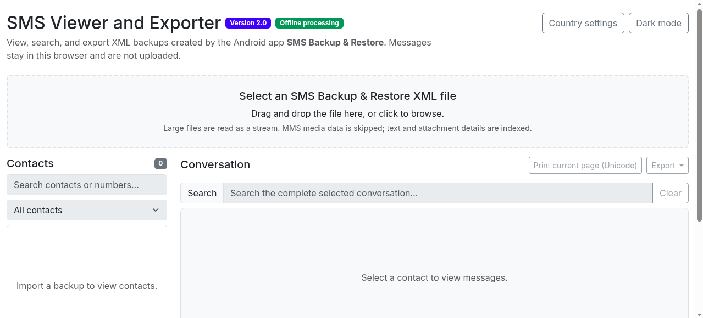
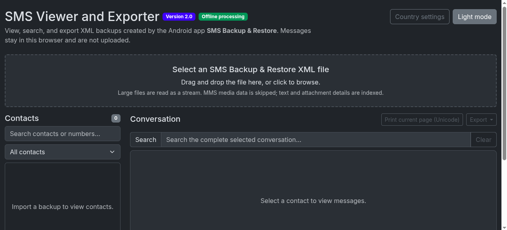
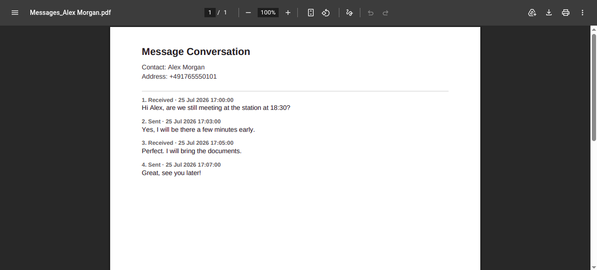

# SMS Viewer and Exporter

Version 2 is an offline-first browser application for viewing, searching, and exporting XML message backups created by the Android app **SMS Backup & Restore** by SyncTech. This project is independent and is not affiliated with or endorsed by SyncTech.

All message processing happens locally in your browser. The application does not upload your backup or message contents.

## Screenshots

### Main interface



### Dark mode



### Conversation PDF export



> The screenshots use synthetic demonstration data. Do not publish screenshots containing real messages, phone numbers, names, or other personal information.

## Quick start

### Option 1: Open `index.html` directly — easiest

This is the simplest way to use the application and does not require Python, Node.js, npm, installation, or an internet connection.

1. Download the latest release ZIP from GitHub.
2. Extract the complete ZIP. Do not move `index.html` away from the other files and folders.
3. Double-click `index.html` or open it with a modern browser.
4. Choose the default country used by the phone when the backup was created.
5. Select or drag an SMS Backup & Restore XML file into the viewer.

For ordinary backups, direct opening should provide the normal viewer, contact list, conversation search, PDF export, and CSV/JSON downloads. Browser behavior for local `file://` pages is not completely identical across all browsers, so persistent storage and very large exports can be less predictable.

### Option 2: Start a local server — most reliable

A local server is optional. It does **not** upload the backup and it is not an application backend. It only lets the browser open the same local files through a stable `http://localhost` address instead of a browser-dependent `file://` address.

From the extracted application folder, run:

```bash
python3 -m http.server 8000 --bind 127.0.0.1
```

Then open:

```text
http://127.0.0.1:8000
```

Stop the server with <kbd>Ctrl</kbd>+<kbd>C</kbd> when finished.

Using localhost is recommended when:

- the browser does not allow the application to work correctly after opening `index.html` directly;
- the last imported index is not restored reliably after restarting the browser;
- the backup is very large;
- a Chromium-based browser should stream a large CSV or JSON export directly to disk;
- the application is being tested or developed.

The `--bind 127.0.0.1` option keeps the temporary server available only on the same computer.

### Direct opening compared with localhost

| Capability | Open `index.html` directly | Open through localhost or HTTPS |
|---|---|---|
| View and search an XML backup | Expected to work in common desktop browsers | Yes |
| PDF export | Expected to work | Yes |
| CSV/JSON export up to 100,000 indexed messages | Blob-download fallback | Yes |
| CSV/JSON export above 100,000 indexed messages | May be unavailable | Direct-to-disk streaming in supported Chromium browsers |
| Restore the IndexedDB index after a browser restart | Browser-dependent | More predictable because the page has a stable origin |
| Python required | No | Only to start the optional local server |
| Messages uploaded | No | No |

## What Version 2 changes

- All application and third-party files are bundled locally; no CDN is contacted.
- Local phone numbers are normalized using a user-selected default country.
- International numbers beginning with `+` or `00` keep their own country code.
- XML files are read as a stream instead of being loaded into one large DOM document.
- Parsed records are stored in IndexedDB instead of being held entirely in memory.
- Conversations use a window of at most 200 rendered messages at a time.
- Imports show progress and can be cancelled safely.
- SMS and MMS text records are supported.
- MMS attachment metadata is shown, while large base64 media payloads are skipped during indexing.
- Full-backup CSV and JSON exports can stream directly to disk in supported browsers.
- The application remains entirely client-side: message contents are not uploaded by this project.

## Supported input

The viewer intentionally supports the message-backup XML format produced by **SMS Backup & Restore**. It is not a general XML, database, VMSG, or CSV viewer.

Supported records:

- `<sms>` messages
- `<mms>` messages, including text parts and attachment metadata
- SMS/MMS records interleaved under the `<smses>` root element

Not currently displayed:

- decoded MMS images, audio, or video
- call-log backups under a `<calls>` root element
- encrypted or compressed backups that have not first been extracted by the user

## First start and country selection

On first start, the viewer asks for the country where the phone was used when the backup was created. This setting is used only for local numbers without an explicit international prefix.

Example with Germany selected:

```text
0176 1234567     -> +49 176 1234567
+49 176 1234567  -> +49 176 1234567
```

A number beginning with `+` or `00` is parsed as an international number regardless of the selected country. The setting can be changed later, but an already imported backup must be imported again before its existing index uses the new country.

## Large-backup design

Version 2 does not promise that every multi-gigabyte backup will fit within every browser's local storage quota. It is designed to avoid the two most common failure modes:

1. The XML file is never converted into one complete in-memory DOM tree.
2. MMS base64 media values are scanned and skipped rather than retained in JavaScript memory or IndexedDB.

Messages are written to IndexedDB in batches. Only one 200-message conversation window is rendered at a time. For backups containing very large amounts of text, the browser still needs enough local storage for the indexed message text and metadata.

## Exports

- **CSV:** complete indexed backup
- **JSON:** complete indexed backup
- **PDF:** selected conversation, limited to 5,000 messages to prevent browser-memory exhaustion
- **Print:** currently visible 200-message window, rendered by the browser with its full installed Unicode-font support

The compact PDF export uses jsPDF's built-in Helvetica font. Emoji are written as `[emoji]`, and characters outside that font's supported encoding are written as `?`. These substitutions affect only the PDF; the original messages remain unchanged in the viewer, CSV, and JSON exports. Use **Print current page (Unicode)** and the browser's **Save as PDF** option when exact emoji or non-Latin glyphs are required.

Chromium-based browsers in a secure context can stream CSV and JSON directly to a user-selected file. Other environments use an in-memory Blob fallback for backups of up to 100,000 indexed messages.

## Privacy and security

- The backup is processed locally in the browser.
- Production HTML references only local scripts and stylesheets.
- The Content Security Policy blocks network connections from the application.
- No analytics, tracking, remote fonts, advertisements, or upload endpoint are included.
- A local IndexedDB index remains in the browser so the last completed import can be restored after reload.

Anyone with access to the same browser profile may be able to access that local index. Clear the site's browser storage when working on a shared computer.

## Installation for developers

Clone the repository:

```bash
git clone https://github.com/petrk94/smsviewer.git
cd smsviewer
```

Install the exact development dependencies:

```bash
npm ci
```

Rebuild the bundled local vendor directory:

```bash
npm run vendor
```

Run tests:

```bash
npm test
npm run test:performance
npm run test:browser
npm run test:syntax
```

Python is used only by the optional local server command and the developer browser smoke test. It is not required to open `index.html` directly.

## Third-party software and licenses

Exact dependency versions and their license files are documented in [`THIRD_PARTY_NOTICES.md`](THIRD_PARTY_NOTICES.md). File sizes and SHA-256 checksums are recorded in [`vendor/manifest.json`](vendor/manifest.json). Redistributed libraries and their required copyright and license notices are retained in the vendor files and in `vendor/licenses/`.

## Project license

The original project code is released under the MIT License. See [`LICENSE`](LICENSE). Third-party components remain under their respective licenses.
